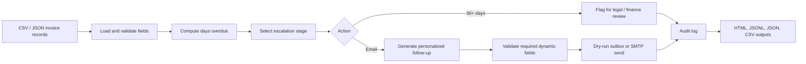

# Finance Credit Follow-Up Email Agent

Task 2 prototype for the AI Enablement Internship brief: an agent that reads pending invoice records, determines the correct escalation stage, generates personalized follow-up emails, and logs every action in dry-run mode by default.

## Features

- Reads pending credit records from CSV or JSON.
- Detects overdue invoices and maps them to the required escalation matrix.
- Generates stage-specific emails with client name, invoice number, amount, due date, days overdue, and payment link.
- Flags invoices over 30 days overdue for manual legal/finance review instead of sending another email.
- Writes a JSONL audit log, generated email outbox, CSV summary, and HTML report.
- Defaults to dry-run mode so no real clients are emailed during testing.

## Quick Start

```bash
python3 app.py --as-of 2026-05-10
```

Outputs are written to `outputs/`:

- `audit_log.jsonl`
- `generated_emails.json`
- `followup_summary.csv`
- `report.html`

Run tests:

```bash
python3 -m unittest discover -s tests
```

## Input Format

CSV columns:

```text
invoice_no,client_name,contact_name,contact_email,amount_due,due_date,follow_up_count,payment_link,account_manager,currency
```

`due_date` must use `YYYY-MM-DD`. The sample dataset is in `data/pending_invoices.csv`.

## Escalation Matrix

| Days overdue | Stage | Tone | Action |
| --- | --- | --- | --- |
| 1-7 | 1st Follow-Up | Warm & Friendly | Generate email |
| 8-14 | 2nd Follow-Up | Polite but Firm | Generate email |
| 15-21 | 3rd Follow-Up | Formal & Serious | Generate email |
| 22-30 | 4th Follow-Up | Stern & Urgent | Generate email |
| 30+ | Escalation Flag | Flag for Legal | Manual review, no auto email |

## Agent Architecture



## LLM and Framework Choice

For the internship prototype, the committed implementation uses a deterministic local generator that follows the same structured prompt contract an LLM would use. This keeps the demo free, reproducible, and safe to run without leaking invoice data to a cloud model.

Recommended production LLM: GPT-4o or Gemini 1.5 Flash for low-latency email generation with strong instruction following. The prompt should be constrained to return a JSON object with `subject` and `body`.

Recommended production framework: LangGraph. The workflow is naturally stateful: load records, classify stage, generate content, validate output, send or flag, and log. LangGraph would make each step explicit and auditable.

## Prompt Design

Production system prompt:

```text
You are a finance follow-up email assistant. Generate one professional payment follow-up email.
Use only the invoice data provided. Do not invent invoice numbers, dates, amounts, people, or payment links.
Match the requested tone stage exactly. Return JSON with subject and body.
```

Required user payload:

```json
{
  "client_name": "Kapoor Textiles",
  "contact_name": "Rajesh Kapoor",
  "invoice_no": "INV-2026-001",
  "amount_due": "INR 45,000",
  "due_date": "07 May 2026",
  "days_overdue": 3,
  "payment_link": "https://pay.example.com/invoices/INV-2026-001",
  "stage": "1st Follow-Up",
  "tone": "Warm & Friendly",
  "cta": "Pay now link / bank details"
}
```

Guardrails used in this prototype:

- Required field validation before generation.
- Post-generation validation to ensure all dynamic invoice fields appear in the email.
- Dry-run logging as the default behavior.
- No automatic email after the legal escalation threshold.

## Security Mitigations

| Risk | Mitigation |
| --- | --- |
| Prompt injection | Treat invoice data as untrusted input. Use structured payloads, fixed system prompts, and output validation. |
| Data privacy / PII | Mask contact emails in audit logs. Avoid sending invoice data to cloud LLMs in the default prototype. |
| API key exposure | Keep credentials in `.env`; `.env` is ignored by git. `.env.example` documents required variables. |
| Hallucination risk | Validate generated emails contain the exact invoice number, amount, due date, days overdue, client, contact, and payment link. |
| Unauthorized access | If exposed as an API, add API key or OAuth authentication and rate limiting. |
| Email spoofing | Use verified sender domains with SPF, DKIM, and DMARC before enabling live sending. |
| Accidental live email | Dry-run is the default. Live SMTP requires the explicit `--send` flag. |

## Live Sending

The prototype includes a guarded SMTP path for demonstration:

```bash
python3 app.py --send --sender finance@example.com
```

It expects a local SMTP server. Production use should replace this with authenticated SMTP, SendGrid, or Mailgun configuration and a human approval step for high-risk stages.
